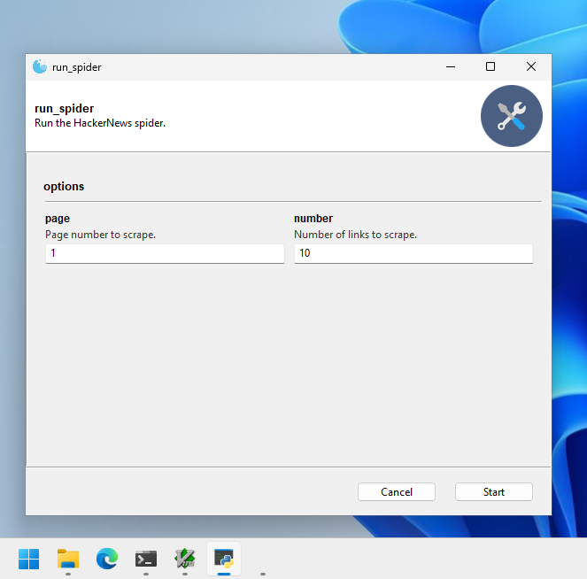
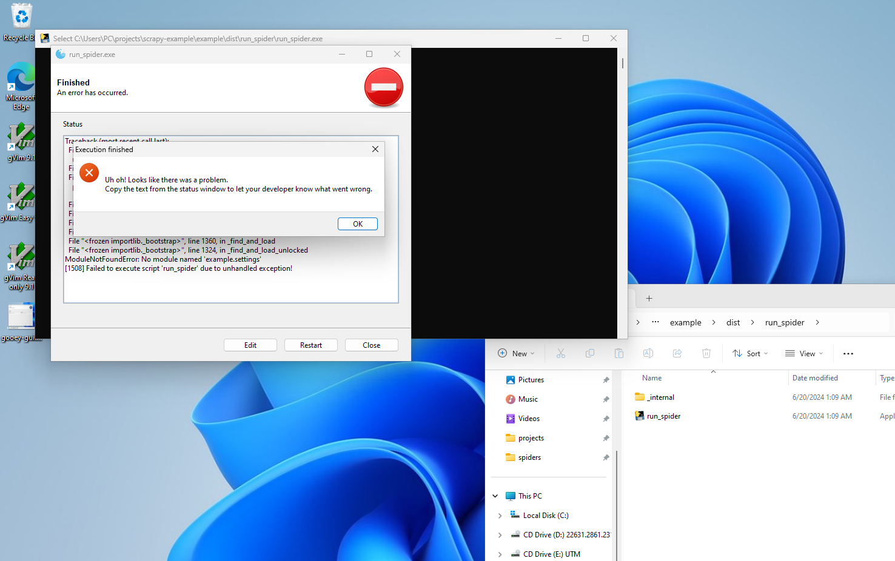
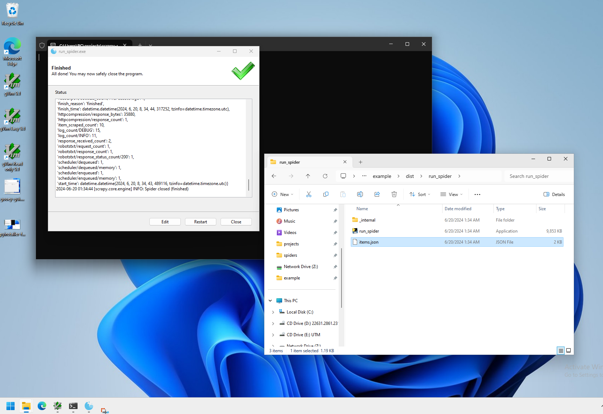

+++
title = "Creating and shipping a fast, user-friendly website crawler with Python, Scrapy, Gooey and PyInstaller"
date = 2024-05-21
updated = 2024-06-18
description = "In this blog post, a website crawler is made using Scrapy complete with a multi-platform executable and GUI."

[taxonomies]
tags = ["python", "web-scraping", "tutorial"]

[extra]
toc = true
quick_navigation_buttons = true
+++


# Intro

> Did you automate a process at your job with Python and want to share it with coworkers? 
> Or maybe, you just made a cool program and want to share it with someone you know?
> Here is a way to share it with others who aren't tech savvy and aren't expected to install Python. 

This is a tutorial for Python programmers. In this tutorial, we will walk through a quick solution for making a Python program easier-to-share and more user-friendly.

As an example, I turn a [Scrapy](https://github.com/scrapy/scrapy) Python script into a user-friendly GUI program. But, the approach described here can be used really for any Python program.

This solution came from a [Stack Overflow answer](https://stackoverflow.com/questions/51213515/pyinstaller-error-on-scrapy/51236394#51236394) I wrote years ago while working on a project for a company. It was the first major project I worked on for a company, so there is some nostalgia here.


# Tutorial

In this tutorial, we will be leveraging these projects:

- [Scrapy](https://github.com/scrapy/scrapy)
- [Gooey](https://github.com/chriskiehl/Gooey)
- [PyInstaller](https://github.com/pyinstaller/pyinstaller)

Let's jump in.


## Writing a basic Python web crawler with Scrapy

If you already have a Python program in mind or you are not interested in creating a web crawler, **skip this section**. 

Scrapy is a web scraping framework for Python. We will be using it to create a minimal web crawler. We will mostly be following the [Scrapy tutorial](https://docs.scrapy.org/en/latest/intro/tutorial.html).

First, install Scrapy:

```
pip install scrapy
```

Next, create a new Scrapy project:

```
scrapy startproject example
```

This creates a new directory called `example` with the following structure:

```
example/
    scrapy.cfg
    example/
        __init__.py
        items.py
        middlewares.py
        pipelines.py
        settings.py
        spiders/
            __init__.py
```
This is because Scrapy is a project-based framework. The `example` directory is the project directory. The `example` directory inside the project directory is the actual Python package. The `spiders` directory is where we will put our spiders.

Now, create a new spider called `spider` with the following commands:

```
cd example
scrapy genspider spider example.com
```

Edit the spider file, which is located at `example/example/spiders/spider.py`. Here is the default code generate for the spider:

```python
import scrapy

class SpiderSpider(scrapy.Spider):
    name = 'spider'
    start_domains = ['example.com']
    start_urls = ['http://example.com']

    def parse(self, response):
        pass
```

Instead, we are going to make the spider a little more interesting. The spider will scrape the links on the front page of Hacker News.

```python
import scrapy

class SpiderSpider(scrapy.Spider):
    name = 'spider'
    start_domains = ['news.ycombinator.com']
    start_urls = ['https://news.ycombinator.com/news']

    def parse(self, response):
        for link in response.css('.titleline > a'):
            yield {
                'title': link.css('::text').get(),
                'url': link.css('::attr(href)').get()
            }
```

NOTE: The `yield` keyword is used to return a generator. In this case, we are returning a dictionary with the title and URL of the link. This is how Scrapy works. It is an asynchronous framework that uses generators to return data.

Now, let's test the spider:

```
scrapy crawl spider
```

In addition to other output, this will output the links on the front page of Hacker News. Like so:

```
2024-06-19 20:16:58 [scrapy.core.scraper] DEBUG: Scraped from <200 https://news.ycombinator.com/news>
{'title': 'X debut 40 years ago (1984)', 'url': 'https://www.talisman.org/x-debut.shtml'}
2024-06-19 20:16:58 [scrapy.core.scraper] DEBUG: Scraped from <200 https://news.ycombinator.com/news>
{'title': 'The return of pneumatic tubes', 'url': 'https://www.technologyreview.com/2024/06/19/1093446/pneumatic-tubes-hospitals/'}
2024-06-19 20:16:58 [scrapy.core.scraper] DEBUG: Scraped from <200 https://news.ycombinator.com/news>
{'title': 'Agricultural drones are transforming rice farming in the Mekong River delta', 'url': 'https://hakaimagazine.com/videos-visuals/rice-farming-gets-an-ai-upgrade/'}
2024-06-19 20:16:58 [scrapy.core.scraper] DEBUG: Scraped from <200 https://news.ycombinator.com/news>
{'title': 'Vannevar Bush Engineered the 20th Century', 'url': 'https://spectrum.ieee.org/vannevar-bush'}
2024-06-19 20:16:58 [scrapy.core.scraper] DEBUG: Scraped from <200 https://news.ycombinator.com/news>
{'title': 'Zep AI (YC W24) is hiring back end engineers to build LLM long-term memory', 'url': 'https://www.ycombinator.com/companies/zep-ai/jobs/J5TD9KW-backend-engineer'}
```

Now, we will have the spider save the output to a JSON file. While you could manually write code to save the output to a file, Scrapy has a built-in feature to save the output to a file. In the `settings.py` file, add the following lines at the bottom:

```python
FEEDS={
    'items.json': {
        'format': 'json',
        'overwrite': True,
        'item_classes': ['example.items.HackerNewsItem'],
        'item_export_kwargs': {
            'export_empty_fields': True,
        }
    }
}
```

Next, we have to create the item class. In the `items.py` file, add the following code:

```python
import scrapy

class HackerNewsItem(scrapy.Item):
    title = scrapy.Field()
    url = scrapy.Field()
```

Finally, we have to modify the spider to use the item class. Adjust the `spider.py` file to look like this:

```python
import scrapy
from example.items import HackerNewsItem

class SpiderSpider(scrapy.Spider):
    name = 'spider'
    start_domains = ['news.ycombinator.com']
    start_urls = ['https://news.ycombinator.com/news']

    def parse(self, response):
        for link in response.css('.titleline > a'):
            item = HackerNewsItem()
            item['title'] = link.css('::text').get()
            item['url'] = link.css('::attr(href)').get()
            yield item
```

Now, when you run the spider, it will save the output to a JSON file called `items.json` in the project directory.

So, run the spider:

```
scrapy crawl spider
```

And the output will be saved to `items.json`, which will look like this:

```json
[
{"title": ["Agricultural drones are transforming rice farming in the Mekong River delta"], "url": "https://hakaimagazine.com/videos-visuals/rice-farming-gets-an-ai-upgrade/"},
{"title": ["1/25-scale Cray C90 wristwatch"], "url": "http://www.chrisfenton.com/1-25-scale-cray-c90-wristwatch/"},
{"title": ["Carabiner Collection"], "url": "https://www.carabinercollection.com/"},
{"title": ["EasyOS: An experimental Linux distribution"], "url": "https://easyos.org/"},
{"title": ["The short, happy reign of CD-ROM"], "url": "https://www.fastcompany.com/91128052/history-of-cd-roms-encarta-myst"},
{"title": ["OSRD: Open-Source Railway Designer"], "url": "https://osrd.fr/en/"},
{"title": ["The Vulture and the Little Girl"], "url": "https://en.wikipedia.org/wiki/The_Vulture_and_the_Little_Girl"},
{"title": ["Brain circuit scores identify clinically distinct biotypes in depression/anxiety"], "url": "https://www.nature.com/articles/s41591-024-03057-9"}
]
```

We now have a basic web crawler. In the next section, we will make will add arguments to the spider with `argparse`.

This is a necessary step because we will be creating a quick GUI with Gooey. Gooey uses `argparse` arguments to create fields in the GUI application. So, we need to have arguments in place before we can create the GUI.


## Creating arguments with `argparse`

`argparse` is a built-in Python module that is used to parse command-line arguments. We will be using it to add arguments to the spider. For the purposes of this tutorial, we will just add two basic arguments: `--page` and `--number`, which will be used to specify which page number to scrape and the number of links to scrape, respectively.

Read more about `argparse` [here](https://docs.python.org/3/library/argparse.html).

We are going to create a new script which will be used to run the spider. This script will use `argparse` to add arguments to the spider. This is because, up until this point, we have been running the spider with the `scrapy crawl spider` command. But, we want to be able to run the spider in our own way with arguments.

Create a new file called `run_spider.py` in the project directory. Add the following code to the file:

```python
import argparse
from scrapy.crawler import CrawlerProcess
from scrapy.utils.project import get_project_settings
from example.spiders.spider import SpiderSpider

def main():
    parser = argparse.ArgumentParser(description='Run the HackerNews spider.')
    parser.add_argument('--page', type=int, default=1, help='Page number to scrape.')
    parser.add_argument('--number', type=int, default=10, help='Number of links to scrape.')
    args = parser.parse_args()

    process = CrawlerProcess(get_project_settings())
    process.crawl(SpiderSpider, page=args.page, number=args.number)
    process.start()

if __name__ == '__main__':
    main()
```

Now, we are going to edit the spider to accept the arguments. In the `spider.py` file, add the following code:

```python
import scrapy
from example.items import HackerNewsItem

class SpiderSpider(scrapy.Spider):
    name = 'spider'
    start_domains = ['news.ycombinator.com']
    start_urls = ['https://news.ycombinator.com/news']

    def __init__(self, page=1, number=10, *args, **kwargs):
        super(SpiderSpider, self).__init__(*args, **kwargs)
        self.page = page
        self.number = number

    def parse(self, response):
        # If page argument is provided, scrape that page 
        if self.page:
            start_urls = [f'https://news.ycombinator.com/news?p={self.page}']
        # If the number argument is provided, scrape that number of links
        if self.number:
            count = 0
            for link in response.css('.titleline > a'):
                    item = HackerNewsItem()
                    item['title'] = link.css('::text').get()
                    item['url'] = link.css('::attr(href)').get()
                    yield item
                    count += 1
                    if count >= self.number:
                        return
```

With the new arguments, the spider can be invoked with the `run_spider.py` script. For example, to scrape the first page and scrape 5 links, run the following command:

```
python run_spider.py --page 1 --number 5
```

This will create the `items.json` file with the first 5 links on the first page of Hacker News.

In the next step, we will use Gooey to quickly create a GUI for the `run_spider.py` script.


## Setting up a GUI with Gooey

[Gooey](https://github.com/chriskiehl/Gooey) is a Python library that creates a GUI for command-line programs. It uses `argparse` to create fields in the GUI application. It is a great solution for quickly creating a GUI for a Python program without having to dive into too much GUI programming.

First, install Gooey:

```
pip install Gooey
```
Once installed, Gooey attaches to whatever method with the `argparse` parser with a decorator (`@Gooey` in the example below). In this case, we will attach Gooey to the `main` function in the `run_spider.py` script from the previous section.

Add the Gooey decorator to the `main` function in the `run_spider.py` file:

```python
import argparse
from scrapy.crawler import CrawlerProcess
from scrapy.utils.project import get_project_settings
from example.spiders.spider import SpiderSpider
from gooey import Gooey, GooeyParser

@Gooey
def main():
    parser = GooeyParser(description='Run the HackerNews spider.')
    parser.add_argument('--page', type=int, default=1, help='Page number to scrape.')
    parser.add_argument('--number', type=int, default=10, help='Number of links to scrape.')
    args = parser.parse_args()

    process = CrawlerProcess(get_project_settings())
    process.crawl(SpiderSpider, page=args.page, number=args.number)
    process.start()

if __name__ == '__main__':
    main()
```

And, that's it. A GUI now exists for the program in less than 30 seconds. What is even better is that Gooey is multi-platform, so the GUI will work on Windows, macOS, and Linux. Not bad at all!

Now, when you run the `run_spider.py` script, a GUI will appear with fields for the `--page` and `--number` arguments. You can run the spider by filling in the fields and clicking the `Start` button.



Aside: If you want your program to look more user-friendly, you can add custom icons to Gooey. Read more about that [here](https://github.com/chriskiehl/Gooey?tab=readme-ov-file#customizing-icons).


## Freezing your application with PyInstaller

*The term 'freezing' refers to the process of converting a Python program into a standalone executable. This is useful for sharing Python programs with non-technical people. PyInstaller is a tool that does this. Sometimes the process is referred to as 'bundling' or 'packaging' or even 'distributing'.*

PyInstaller is a tool that bundles a Python program into a single, easy-to-run executable. It is a great tool for sharing Python programs with non-technical people.

Before starting with PyInstaller, I recommend reading the [PyInstaller documentation](https://pyinstaller.readthedocs.io/en/stable/). PyInstaller can be a bit tricky to use, but the documentation will clear things up. The problem is: generally no one reads the documentation enough if at all.

Otherwise, you may run into issues like [this](https://stackoverflow.com/questions/51213515/pyinstaller-error-on-scrapy/51236394#51236394), which sparked this blog post...albeit years later 🐌. You will basically get a ton of `ImportErrors` because PyInstaller does not know how to handle the dependencies of Scrapy (or other Python modules your program depends on). PyInstaller is kinda 'dumb'--you need to tell it what to do.

In a nutshell, PyInstaller works by analyzing your Python program and creating a single executable that includes all the dependencies--including the Python Interpreter. This means that the person running the executable does not need to have Python installed. They can just run the executable. From the docs:

> PyInstaller reads a Python script written by you. It analyzes your code to discover every other module and library your script needs in order to execute. Then it collects copies of all those files – including the active Python interpreter! – and puts them with your script in a single folder, or optionally in a single executable file.


The **two keys things** programmers need to know about PyInstaller are:

- Create a spec file, which is important for telling PyInstaller how to build the executable
- Use hook files, which are specific files for popular Python modules to tell PyInstaller hwo to catch any dependencies it misses

Let's get started. First, install PyInstaller:

```
pip install pyinstaller
```

Then, we will create what is called a "spec" file. This file is used to configure the PyInstaller build process. To create the spec file, run the following command:

```
pyi-makespec run_spider.py
```

The 'default' spec file is pretty bare-bones. It will look something like this:

```python
# -*- mode: python ; coding: utf-8 -*-


a = Analysis(
    ['run_spider.py'],
    pathex=[],
    binaries=[],
    datas=[],
    hiddenimports=[],
    hookspath=[],
    hooksconfig={},
    runtime_hooks=[],
    excludes=[],
    noarchive=False,
    optimize=0,
)
pyz = PYZ(a.pure)

exe = EXE(
    pyz,
    a.scripts,
    [],
    exclude_binaries=True,
    name='run_spider',
    debug=False,
    bootloader_ignore_signals=False,
    strip=False,
    upx=True,
    console=True,
    disable_windowed_traceback=False,
    argv_emulation=False,
    target_arch=None,
    codesign_identity=None,
    entitlements_file=None,
)
coll = COLLECT(
    exe,
    a.binaries,
    a.datas,
    strip=False,
    upx=True,
    upx_exclude=[],
    name='run_spider',
)
```

PyInstaller has come a long way since I first used it. It now has a library of pre-made hooks for popular Python modules. See: [PyInstaller hooks](https://github.com/pyinstaller/pyinstaller/tree/develop/PyInstaller/hooks). This is great because it means you don't have to write your own hooks for popular Python modules. But, you may still have to write your own hooks for less popular Python modules.

PyInstaller also does a good job of catching dependencies and applying hooks. This can be seen by building the executable with the default spec file, which automatically applies `hook-gooey.py` and `hook-scrapy.py` hooks:

```
pyinstaller run_spider.spec
```

**But, this still does not produce a working executable.** To run the single-file executable, go to the `dist/run_spider` directory and run the executable. You will see that it does not work. See:




The error message is:

```
ModuleNotFoundError: No module named 'example.settings'
```

To fix this, we need to edit the spec file to include the `example.settings` hidden import. Add the following line to the `Analysis` class in the spec file:

```python
a = Analysis(
    ['run_spider.py'],
    pathex=[],
    binaries=[],
    datas=[],
    hiddenimports=['example.settings'],
    hookspath=[],
    hooksconfig={},
    runtime_hooks=[],
    excludes=[],
    noarchive=False,
    optimize=0,
)
...
```

This tells PyInstaller to include the `example.settings` module in the executable. This is necessary because the `example.settings` module is imported indirectly in the `run_spider.py` script with the `get_project_settings()` function. This is an example of a 'hidden import'. PyInstaller does not know about this import, so we have to tell it about it.

Now, build the executable again:

```
pyinstaller run_spider.spec
```

NOTE: This should be run in the root of the project, which tree looks like this:

```
example/
    scrapy.cfg
    example/
        __init__.py
        items.py
        middlewares.py
        pipelines.py
        settings.py
        spiders/
            __init__.py
            spider.py
    dist/
    run_spider.py
    run_spider.spec
```


This works! It produces a single-file self-extracting executable in the root of your project here `dist/run_spider/run_spider`. You can run the program by just double-clicking the executable. See:




Sometimes, depending on the complexity of a Python program and the number of its dependencies (and how those dependencies import modules), PyInstaller may not work. You are not always so lucky. In general, the 'flow' to get PyInstaller to work is:

1. Create a spec file
2. Try to build the executable
3. If the executable fails to build, edit the spec file
4. Try to build the executable again
5. Try to run the executable
6. If the executable fails to run, edit the spec file or your Python code to make it work

So basically, there is a lot of trial-and-error.

But, now that we have come this far, you are ready to share your executable with the world. You can share the executable with anyone, and they can run it without having Python installed. This is a great way to share Python programs.

This same process can be repeated for other platforms. However, further configuration may be needed for different platforms. For example, you may need macOS-specific spec file options, which are documented [here](https://pyinstaller.org/en/stable/spec-files.html#spec-file-options-for-a-macos-bundle).

It is important to note, however, that PyInstaller is not a cross-compiler. This means that you cannot build a Windows executable on a Linux machine, or vice versa. You must build the executable on the platform you want to distribute it on. This extends further--a Windows 10 executable will not run on Windows 7, though a Windows 7 executable will probably run on Windows 10 (for backwards compatability). So, you must build the executable on the platform you want to distribute it on.

But, you could leverage virtual machines to build the executable on different platforms. For example, you could use a Windows virtual machine via UTM (which works via QEMU) on macOS to build a Windows executable. And, this build process can be automated with a CI/CD pipeline to automatically build the executable on different platforms.

**And, that's it. You have created a Python program with a GUI and bundled it into a single, shareable executable. 🎊**


# Going Further

Considering we started with a single Python script file, this solution is pretty good: it has a GUI, it can be built multi-platform, and it can be shared via a single executable. This is a great solution for sharing Python programs with non-technical people, or distributing your program to a wider audience.

But, here are some valid questions to ask:

- What if you wanted to update the program remotely? Right now, every time you update the program, you need to rebuild it and re-share it with people. Consider devising a way to push updates remotely.

- PyInstaller can sometimes be a pain in that it is flagged by Windows Security. Consider using alternative packaging tool like [BeeWare Briefcase](https://github.com/beeware/briefcase).

- The way PyInstaller bundles your program includes your source Python code in the final distribution. What if you wanted to hide your source code? Consider using a tool like [PyArmor](https://github.com/dashingsoft/pyarmor) or [PyInstaller with Cython](https://pyinstaller.readthedocs.io/en/stable/advanced-topics.html#using-cython-to-compile-python-code).

- Is your little program gaining popularity? Consider writing your program to leverage more popular tools like Flutter. Or, consider going as far as to develop a native application. Python is a great, high-level language used primarily for automation, data science, and scripting. But, it is atypical for GUI applications. There is a right tool for every job. So, use the right tools.


---

# Thank you

Thanks for reading. Feel free to leave some comments. I love to hear from readers.

Did this blog post help you solve a major problem? Consider helping the open-source community by contributing to the projects mentioned in this blog post. Or, even better: donate to the projects. Open-source projects are maintained by volunteers and donations help keep the projects alive.


